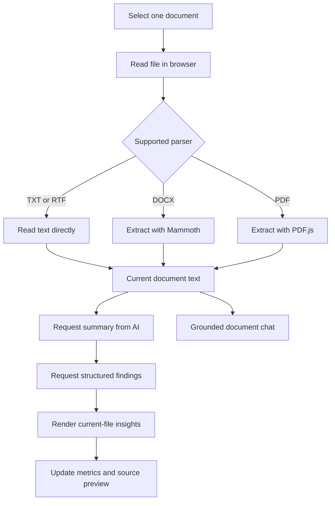

# DocScan AI

DocScan AI is a browser-based business document intelligence workspace. Upload one document, extract readable source text, generate document-specific insights, and ask grounded questions about the active file.

The interface is intentionally document-first: the workspace shows one current file at a time, and analysis, findings, metrics, and chat are scoped to that file.

## Features

### Document analysis

- Upload one current document at a time
- Supported upload types:
  - PDF
  - DOCX
  - TXT
  - RTF
  - DOC upload is accepted, but browser-side text extraction for legacy `.doc` files may require a server-side converter
- Drag-and-drop upload support
- Source text preview in the document workspace
- Animated scanning overlay while extraction and AI analysis are running
- Current-file replacement when a new document is uploaded
- Remove the active file and clear its analysis context

### AI insights

- Document-specific summary generation
- Findings for:
  - Deadlines
  - Obligations
  - Missing data
  - Anomalies
  - Financial values
- AI-generated finding titles and source details
- Text-based fallback detection for dates, payment terms, obligations, missing information, and anomalies
- Per-document confidence and data completeness scores
- Per-document analysis duration
- Findings count synchronized with the current document

### AI document chat

- Chat is limited to the active document
- Source-grounded question suggestions
- Automatic scroll to the newest message
- Concise AI response instructions
- Chat remains disabled until a document has been extracted
- Supports questions about risks, deadlines, payment terms, missing information, obligations, and financial values

### Authentication and storage

- Firebase Email/Password authentication
- Firebase Google authentication
- Firebase anonymous guest access
- Firebase browser-local session persistence
- Firebase Storage upload support for signed-in users
- Firebase Storage cleanup when a stored document is removed

### Responsive interface

- Desktop dashboard layout
- Tablet stacked workspace layout
- Mobile top navigation with hamburger menu
- Mobile-friendly document workspace and chat area
- Horizontal overflow protection for narrow screens
- Responsive source preview, metrics, cards, and footer

## Project Structure

```text
DocScan AI/
├── index.html            # Application markup and document workspace
├── styles.css            # Visual system, responsive rules, and animations
├── app.js                # Firebase, upload, extraction, AI, chat, and UI logic
├── firebase-config.js    # Firebase web app configuration
└── README.md             # Project documentation
```

## Requirements

- A modern browser with ES module support
- Node.js is optional and only needed for development tooling or validation
- Firebase project for authentication and Storage
- OpenRouter or OpenAI-compatible API key for live AI analysis
- A local HTTP server; do not open `index.html` directly with `file://`

## Run Locally

The current project is a static app and does not require a build step.

From the project directory:

```bash
python3 -m http.server 4173
```

Open:

```text
http://localhost:4173/
```

An alternative IPv4 address is:

```text
http://127.0.0.1:4173/
```

Use one hostname consistently during Firebase authentication. `localhost` and `127.0.0.1` are treated as different authorized domains.

## Firebase Setup

### 1. Create a Firebase project

1. Open the Firebase Console.
2. Create or select a project.
3. Add a Web App to the project.
4. Copy the Firebase web configuration object.

### 2. Configure the app

Update `firebase-config.js`:

```js
export const firebaseConfig = {
  apiKey: "YOUR_FIREBASE_API_KEY",
  authDomain: "YOUR_PROJECT.firebaseapp.com",
  projectId: "YOUR_PROJECT_ID",
  storageBucket: "YOUR_PROJECT.firebasestorage.app",
  messagingSenderId: "YOUR_SENDER_ID",
  appId: "YOUR_APP_ID"
};
```

The Firebase web API key is not a server secret. Access control must be enforced with Firebase Authentication, Storage Rules, and server-side security controls.

### 3. Enable Authentication providers

In **Firebase Console → Authentication → Sign-in method**, enable:

- Email/Password
- Google
- Anonymous

For Google sign-in, configure the project support email when Firebase requests it.

### 4. Add authorized domains

In **Firebase Console → Authentication → Settings → Authorized domains**, add the hostnames you use locally and in production:

```text
localhost
127.0.0.1
```

Do not include the port number. For example, `localhost:4173` is authorized by adding `localhost`.

### 5. Enable Storage

1. Open **Firebase Console → Storage**.
2. Create a Storage bucket.
3. Choose the appropriate region.
4. Configure Storage Rules before production use.

A recommended starting rule pattern is to allow users to access only their own document path:

```text
/users/{userId}/documents/{documentId}
```

Do not use open read/write rules in production.

## AI Provider Setup

1. Open the **Settings** panel in DocScan AI.
2. Select **OpenRouter**.
3. Paste an OpenRouter key beginning with:

```text
sk-or-v1-...
```

4. Save the connection.
5. Upload a document.

The app routes OpenRouter requests to:

```text
https://openrouter.ai/api/v1/chat/completions
```

The default model is:

```text
openai/gpt-4o-mini
```

The app also supports an OpenAI-compatible provider option using:

```text
https://api.openai.com/v1/chat/completions
```

### Important production note

The current static prototype stores the AI key in browser `localStorage` and calls the provider from the browser. This is suitable only for local testing.

For production:

1. Move AI calls to a server-side endpoint or Firebase Cloud Function.
2. Store provider keys in server-side secrets.
3. Send only the authenticated user ID and document reference from the browser.
4. Enforce Firebase Authentication and Storage Rules.
5. Add rate limits and request logging without storing document contents unnecessarily.

## Analysis Flow



## Current-File Behavior

DocScan AI intentionally keeps one active document in the workspace.

When a new file is selected:

1. The previous document row is removed.
2. Previous extracted text is cleared.
3. The scanning overlay appears.
4. The new file becomes the active document.
5. Source text extraction begins.
6. AI summary and findings are generated from that file.
7. Metrics, findings, source preview, and chat update for the new file.
8. Previous asynchronous analysis cannot overwrite the newer file.

## Browser-Side Parsing

The application loads parser libraries dynamically when needed:

- PDF.js for PDF text extraction
- Mammoth for DOCX text extraction

TXT and RTF files use the browser File API directly.

Legacy `.doc` files are accepted by the input control, but reliable extraction of binary legacy Word documents should be handled by a backend conversion service in production.

## Troubleshooting

### The page does not load

Start the local server from the project directory:

```bash
python3 -m http.server 4173
```

Then open:

```text
http://localhost:4173/
```

Do not open the HTML file directly from Finder.

### Google sign-in says unauthorized domain

Check the browser hostname. Add the exact hostname to Firebase Authorized Domains:

- `localhost`
- `127.0.0.1`

The port does not belong in the Firebase domain list.

Also verify that Google is enabled under **Authentication → Sign-in method**.

### Google account selection returns but sign-in does not finish

- Use a hard refresh: `Cmd + Shift + R`
- Use the same hostname consistently
- Confirm the Firebase config belongs to the same Firebase project
- Confirm Google is enabled
- Check the browser console for the exact Firebase error

The app uses browser-local Firebase persistence and redirect handling for Google authentication.

### The AI says no API key is available

- Open Settings
- Select OpenRouter
- Paste the full `sk-or-v1-...` key
- Save the connection
- Upload the file again

The key is saved locally in the browser for this prototype.

### The summary works but findings are empty

The findings request is separate from the summary request. Check:

- The API key is valid
- The selected provider matches the key
- The provider model is available
- The browser can reach the provider endpoint
- The document contains readable text

The app falls back to source-text pattern detection when structured AI findings cannot be parsed.

### The page moves horizontally on mobile

Use a hard refresh after the latest CSS changes. The responsive layout includes viewport overflow protection and mobile-specific grid constraints.

## Validation

Useful checks from the project directory:

```bash
node --check app.js
node --check firebase-config.js
```

The project is also intended to be checked in a browser at desktop, tablet, and mobile widths.

## Deployment Notes

Because this is a static application, it can be deployed to:

- Firebase Hosting
- Netlify
- Vercel static hosting
- GitHub Pages, with suitable Firebase and API configuration
- Any static web server

For production deployment:

- Use HTTPS
- Configure the production hostname in Firebase Authorized Domains
- Move AI calls behind a server-side function
- Add Firebase Storage Rules
- Avoid storing provider keys in browser storage
- Add a Content Security Policy
- Restrict allowed upload size and file types
- Add server-side document scanning limits
- Avoid logging raw document contents

## Ownership

© 2026 Supratik Saha. All rights reserved.
